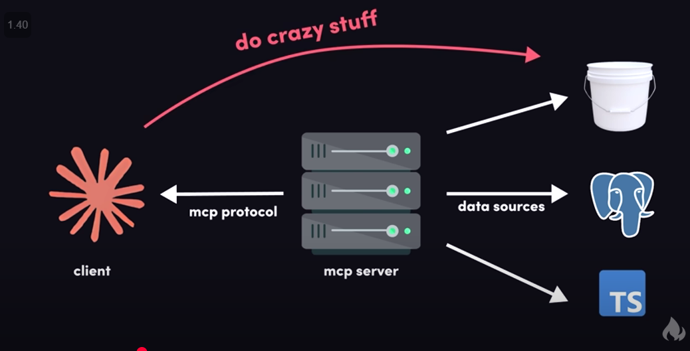
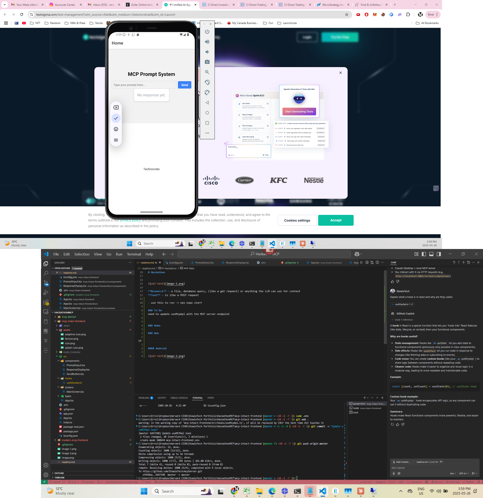
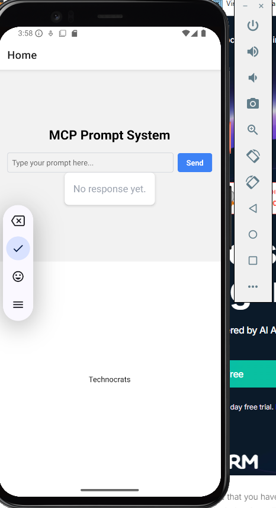

# Hackathon

**Resource** - a file, database query, (like a get request) or anything the LLM can use for context
**Tool** - is like a POST request

- use this to run -> npx expo start

### To Do
need to update useMcpApi with the MCP server endpoint

### Demo

#### Web

#### Android

